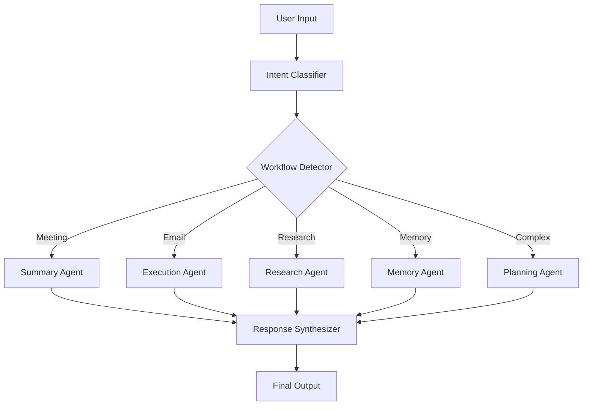

# Cognitive OS — AI Workflow Router Design

## 1. Routing Architecture
The Router operates as a **Mediator & Traffic Controller** between the User Input Layer and the Agent Execution Layer. It uses a **Hybrid Classifier** (LLM + Heuristics) to ensure zero-latency routing for known keywords and high-fidelity reasoning for ambiguous requests.



## 2. Intent Classification Logic
We use a **Two-Pass Classification**:
1. **Pass 1 (Heuristic):** Regex-based fast path for common keywords (e.g., "remind me", "search for").
2. **Pass 2 (Semantic):** LLM-based parsing using a structured JSON schema to extract `workflow_type`, `priority`, and `memory_query`.

## 3. Decision Tree
```text
IF "remind me" OR "at [time]" -> reminder_generation
ELSE IF "summarize" AND "doc" -> document_summarization
ELSE IF "what did I say" OR "recall" -> memory_retrieval
ELSE IF "research" OR "explain" -> research_assistant
ELSE -> LLM intent classification
```

## 4. API Flow
1. `POST /api/v1/agent/execute` -> { task, session_id }
2. `Supervisor` invokes `AIWorkflowRouter.route(task)`
3. `Router` returns `WorkflowRoute` { agent, priority, memory_query }
4. `Supervisor` triggers RAG via `memory_query`
5. `Supervisor` dispatches to `primary_agent`
6. `Agent` returns result -> `Supervisor` synthesizes final output.

## 5. TypeScript Backend Structure
```typescript
// frontend/src/types/workflow.ts

export enum WorkflowType {
  MEETING_SUMMARY = "meeting_summary",
  EMAIL_DRAFTING = "email_drafting",
  REMINDER_GENERATION = "reminder_generation",
  RESEARCH_ASSISTANT = "research_assistant",
  PRODUCTIVITY_ANALYTICS = "productivity_analytics",
  MEMORY_RETRIEVAL = "memory_retrieval",
  CALENDAR_PLANNING = "calendar_planning",
  DOCUMENT_SUMMARIZATION = "document_summarization",
  GENERAL_QUERY = "general_query",
}

export interface WorkflowRoute {
  intent: string;
  workflowType: WorkflowType;
  primaryAgent: string;
  priority: number;
  memoryQuery?: string;
}
```

## 6. FastAPI Implementation Structure
- `app/orchestration/router/core.py`: Intent classification logic.
- `app/orchestration/router/schema.py`: Pydantic models & Enums.
- `app/orchestration/router/heuristics.py`: Fast-path regex rules.

## 7. Agent Mapping Schema
```json
{
  "meeting_summary": "summary-agent",
  "email_drafting": "execution-agent",
  "reminder_generation": "planning-agent",
  "research_assistant": "research-agent",
  "memory_retrieval": "memory-agent",
  "calendar_planning": "planning-agent",
  "document_summarization": "summary-agent"
}
```

## 8. Example Request/Response
**Request:** "Draft an email to Sarah about the meeting tomorrow at 10am."
**Router Output:**
```json
{
  "intent": "Draft a business email with calendar context",
  "workflow_type": "email_drafting",
  "primary_agent": "execution-agent",
  "memory_query": "Sarah meeting tomorrow 10am",
  "priority": 2
}
```

## 9. Error Fallback System
1. **Classifier Error:** Fallback to `general_query` handled by `research-agent`.
2. **Timeout:** If LLM classification > 5s, use Heuristic fallback.
3. **Agent Busy:** Circuit breaker kicks in -> return partial result + "retry" suggestion.
4. **Validation Error:** Return raw input to `supervisor` with `priority: 3`.

## 10. Scalability Strategy
- **Caching:** Cache common intent-to-agent mappings in Redis.
- **Async Execution:** All routing logic is non-blocking (async/await).
- **Horizontal Scaling:** Routers are stateless; deploy as microservices.
- **Model Routing:** Use a small, fast model (e.g., Llama-3.2-3B) for routing and a large model (GPT-4o) for execution.
