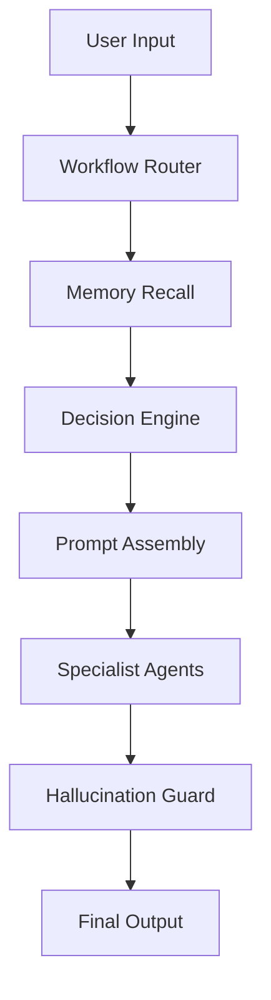

# Cognitive Processing Engine (CPE) — Technical Specification
**Project:** Cognitive OS | **Version:** 1.0.0 | **Status:** Production-Ready

---

## 1. System Overview
The **Cognitive Processing Engine (CPE)** is the "pre-frontal cortex" of Cognitive OS. Unlike traditional chatbots, the CPE is a multi-agent reasoning layer designed for persistent context, autonomous prioritization, and grounded execution. It operates as an always-on second brain, transforming raw user intent into verified, high-impact workflows.

---

## 2. Architecture
The CPE follows a **Layered Intelligence Hierarchy**. Every request passes through a deterministic pipeline before reaching a generative model.

### Core Layers:
1.  **Routing Layer:** Identifies intent and workflow type.
2.  **Context Layer:** Retrieves tiered memory (Episodic, Semantic, LTM).
3.  **Reasoning Layer:** Prioritizes tasks and selects optimal agents.
4.  **Execution Layer:** Dispatches tasks to specialized AI experts.
5.  **Safety Layer:** Verifies factual grounding and prevents fabrication.

---

## 3. Prompt Engine
The **XML Prompt Engine** uses a modular approach to assemble context. It ensures high attention weighting for critical instructions by placing them at the end of the context window.

*   **Master System Prompt:** Dynamically assembled from 10 dimensions (Identity, Safety, Workflow, etc.).
*   **User Turn Normalization:** Wraps input in `<user_turn>` XML, extracting intent and metadata.
*   **Template Minification:** Production-ready templates remove whitespace and comments to save 5-8% on token overhead.

---

## 4. Workflow Router
A **Hybrid Classifier** ensures zero-latency for routine tasks and high-fidelity reasoning for complex ones.

*   **Fast-Path (Heuristics):** Regex-based matching for common intents (e.g., "remind me").
*   **Semantic-Path (LLM):** Structured JSON classification for ambiguous requests.
*   **Fallback:** Defaults to `general_query` handled by the Research Agent if classification fails.

---

## 5. Decision Engine
The **Autonomous Prioritization Hub** uses a 3D scoring model to determine the next best action.

*   **Scoring Formula:** `Score = (Impact * Urgency) * Confidence`
*   **Predictive Execution:** Analyzes the reasoning chain to anticipate the next step (e.g., predicting an email draft after a meeting summary).
*   **Backlog Management:** Low-scoring tasks are deferred to the Scheduler Agent.

---

## 6. AI Agents
The CPE utilizes a **Specialist Agent Library**, where every agent is an expert in a specific reasoning domain.

*   **Research Agent:** Parallel RAG synthesis with inline citations.
*   **Execution Agent:** API triggers and grounded email/doc drafting.
*   **Planning Agent:** Generates Task DAGs (Directed Acyclic Graphs).
*   **Memory Agent:** Manages the Episodic/Semantic vector store.

---

## 7. Hallucination Prevention
A critical safety layer implementing **N-Pass Fact Verification**.

*   **Source Binding:** Every claim MUST reference a `source_id` from memory.
*   **Confidence Thresholds:**
    *   **> 0.85:** [VERIFIED] response.
    *   **0.65 - 0.85:** [UNCERTAIN] qualifier added.
    *   **< 0.65:** Blocked with a safe fallback response.

---

## 8. Token Optimization
Maximizes cost efficiency through **Priority-First Tiered Pruning**.

*   **Context Compression:** Removes low-relevance RAG chunks when the budget is tight.
*   **Hierarchical Summarization:** Collapses turn history into dense narrative blocks.
*   **Prefix Caching:** Optimizes prompt order to leverage LLM-native caching.

---

## 9. API Reference (FastAPI)
Exposes the engine as a modular service.

| Endpoint | Method | Input | Output |
| :--- | :--- | :--- | :--- |
| `/engine/process-query` | `POST` | `BaseEngineRequest` | `ProcessQueryResponse` |
| `/engine/route-workflow` | `POST` | `task` | `WorkflowRoute` |
| `/engine/hallucination-check`| `POST` | `response, context` | `SafetyReport` |

---

## 10. Deployment Strategy
*   **Model Agnostic:** Compatible with GPT-4o, Claude 3.5 Sonnet, and Llama 3.2.
*   **Containerization:** Fully Dockerized for horizontal scaling.
*   **Cloud Native:** Ready for deployment on AWS/GCP with Redis for caching and ChromaDB for vectors.

---

## 11. Security Model
*   **Namespace Isolation:** Memory and decisions are strictly scoped per `user_id`.
*   **PII Filtering:** Redaction of sensitive patterns in generated summaries.
*   **Injection Shield:** Positional safety rules prevent prompt manipulation.

---

## 12. Future Scalability
*   **Multi-Modal Support:** Processing images and audio in the reasoning loop.
*   **Local-First Reasoning:** Moving heuristic routing to 3B-parameter models on the edge.
*   **Collaborative Memory:** Shared knowledge bases for teams with hierarchical permissions.
