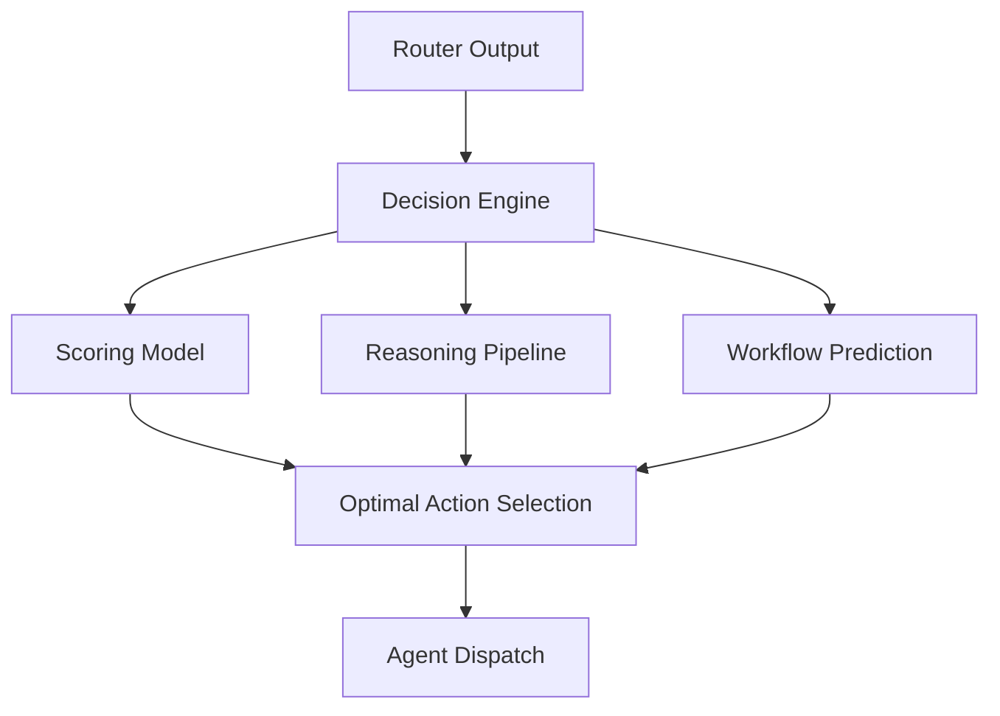

# Cognitive OS — Decision Engine Architecture

## 1. Decision-Making Architecture
The Decision Engine acts as the **Pre-Frontal Cortex** of the OS. It processes high-level goals and context to determine the *optimal path of execution*. It sits between the `WorkflowRouter` (which handles initial categorization) and the `SpecialistAgents` (which handle execution).



## 2. Priority Scoring System
We use a 3D scoring model:
- **Impact (1-10):** How much does this action contribute to the user's primary goals?
- **Urgency (1-10):** How time-sensitive is this task?
- **Confidence (0-1):** How certain is the system about the context retrieved?

**Formula:** `Score = (Impact * Urgency) * Confidence`

## 3. User Intent Ranking
When multiple intents are detected, they are ranked by their **Normalized Priority Score**. The highest-scoring intent is selected for immediate execution, while others are placed in a `backlog` for the **Scheduler Agent**.

## 4. Workflow Prediction Logic
The engine analyzes the `reasoning_chain` to predict the user's next logical step. 
*Example:* If the user asks to "Summarize the meeting," the engine predicts "Draft follow-up email" and "Add tasks to calendar."

## 5. Multi-Agent Coordination Logic
The Decision Engine coordinates agents by:
1. **Selection:** Choosing the primary agent based on the workflow type.
2. **Delegation:** Passing enriched XML context (with priority and reasoning).
3. **Synthesis:** Evaluating if the agent's output satisfies the high-level goal.

## 6. Context Confidence Scoring
- **High (>0.85):** Context is directly relevant and recent.
- **Medium (0.65-0.85):** Context is semantically similar but lacks direct temporal binding.
- **Low (<0.65):** Context is speculative or from general knowledge.

## 7. Decision Tree Examples
- **Case A (High Urgency):** "Send the report now" -> Immediate execution via `execution-agent`.
- **Case B (Low Confidence):** "What did Alex say?" -> Route to `memory-agent` with a request for clarification if multiple "Alex" entities exist.

## 8. AI Reasoning Pipeline
1. **Context Analysis:** Digest User Profile + Episodic Memory.
2. **Option Generation:** List potential agents and workflows.
3. **Simulated Outcome:** Predict the success of each option.
4. **Final Selection:** Choose the option with the highest expected impact.

## 9. Real-time Execution Logic
Implemented as a non-blocking `async` pipeline in `backend/app/orchestration/decision/engine.py`. It uses `LLM Structure Outputs` to ensure deterministic JSON responses for orchestration stability.

## 10. JSON Workflow Schema
```json
{
  "selected_action": {
    "action_id": "summarize_001",
    "description": "Summarize transcript for Project Alpha launch",
    "agent_target": "summary-agent",
    "priority": {
      "impact": 5,
      "urgency": 10,
      "confidence": 0.95
    },
    "reasoning": "High urgency meeting summary requested by user.",
    "predicted_next_actions": ["draft_followup_email"]
  },
  "context_confidence": 0.98,
  "reasoning_chain": [
    "User requested summary of recent meeting.",
    "Episodic memory contains transcript with 95% relevance.",
    "Routing to Summary Agent for distillation."
  ]
}
```
