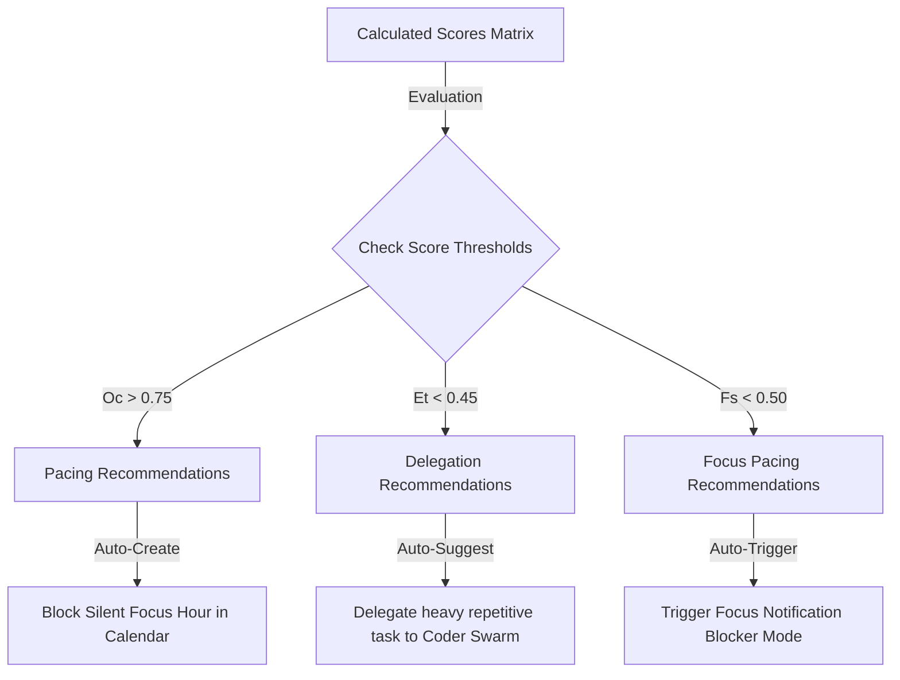

# Cognitive OS — AI-Powered Productivity Scoring Engine
## Mathematical Scoring Formulations, Core Algorithms, Adaptive Recommendations, and Predictive Logic

> [!NOTE]
> This document specifies the comprehensive algorithmic and mathematical architecture for the **Productivity Scoring Engine** of Cognitive OS. It bridges raw user telemetry, multi-agent summaries, and calendar usage into five core metrics: Daily Productivity, Focus, Task Efficiency, Consistency, and Cognitive Overload.

---

## 1. Weighted Scoring Formulas

The scoring engine operates on a multi-dimensional normalized scale ($[0.0, 1.0]$ or $[0, 100]$). It aggregates daily activity feeds into five decoupled mathematical models.

```
       [Raw Inputs]                              [Intermediate Scores]                [Final Output]

  +---------------------+
  |   Task Completion   | -----\
  +---------------------+       \-----> +------------------------+
  |    Focus Sessions   | ------------> |    Focus Score (Fs)    | ---\
  +---------------------+       /-----> +------------------------+     \
  |     App Activity    | -----/                                        \
  +---------------------+               +------------------------+       \--> +-------------------------+
  | Meeting Attendance  | ------------> |  Task Efficiency (Et)  | ---------> | Daily Productivity (Pd) |
  +---------------------+               +------------------------+       /--> +-------------------------+
  |    Calendar Usage   | ------------> |  Consistency Score(Cs) | --/  /
  +---------------------+               +------------------------+     /
  |    Notes Captured   | ------------> |  Cognitive Overload(Oc) | ---/
  +---------------------+               +------------------------+
```

### A. Focus Score ($F_s$)
Measures the duration and depth of sustained attention, penalized by task interruptions and high-frequency active context-switching:

$$F_s = \left( w_f \cdot \frac{T_{focus}}{T_{target\_focus}} \right) + w_c \cdot \left( 1 - \frac{C_{switches}}{C_{max\_threshold}} \right) - w_i \cdot \left( \frac{I_{interruptions}}{I_{limit}} \right)$$

*Where:*
- $T_{focus}$: Total accumulated focus seconds in the daily Pomodoro tracking loops.
- $T_{target\_focus}$: Target daily focus time (baseline: 240 minutes / 14,400 seconds).
- $C_{switches}$: Context switches (app/tab changes) logged per focus hour (threshold max: 30 switches/hr).
- $I_{interruptions}$: Pauses or Pomodoro break violations (limit: 5 breaks per cycle).
- *Weights*: $w_f = 0.5, w_c = 0.3, w_i = 0.2$ (Adaptive based on user preferences).

---

### B. Task Efficiency Score ($E_t$)
Measures task completion velocities against original estimations, heavily prioritizing high-priority objectives:

$$E_t = \frac{\sum_{j=1}^{N} P_j \cdot \left( 2 - \frac{A_j}{E_j} \right)}{\sum_{j=1}^{N} P_j}$$

*Where:*
- $N$: Number of tasks completed in the current analysis window.
- $P_j$: Priority rank score of task $j$ (Low = 1.0, Medium = 2.0, High = 3.0, Critical = 5.0).
- $A_j$: Actual completion time in minutes.
- $E_j$: Original user/agent estimated time in minutes.
- *Constraint*: The execution ratio $\left(2 - \frac{A_j}{E_j}\right)$ is bounded within $[0.2, 1.5]$ to prevent outliers (such as 1-minute tasks distorting averages).

---

### C. Consistency Score ($C_s$)
Measures day-over-day stability of focus time and scheduling discipline, preventing single-day sprint burnout:

$$C_s = 100 \cdot \left( 1 - \frac{\sigma(T_{focus})}{\mu(T_{focus})} \right) \cdot \left( \frac{Calendar_{completed}}{Calendar_{scheduled}} \right)$$

*Where:*
- $\sigma(T_{focus})$: Standard deviation of focus minutes over a sliding 7-day window.
- $\mu(T_{focus})$: Coefficient of mean focus minutes over the same window.
- $Calendar_{completed} / Calendar_{scheduled}$: Ratio of completed calendar events/meetings against scheduled active blocks.

---

### D. Cognitive Overload Score ($O_c$)
Evaluates mental exhaustion, fatigue index accumulations, key cadence typing jitters, and meeting densities:

$$O_c = \left( w_j \cdot Jitter_{typing} \right) + \left( w_s \cdot \frac{C_{switches}}{C_{max}} \right) + \left( w_m \cdot \frac{T_{meetings}}{T_{workday}} \right)$$

*Where:*
- $Jitter_{typing}$: Typings gaps variance (normalized variance of keystroke delay intervals).
- $T_{meetings}$: Accumulated time in active calls/meetings.
- $T_{workday}$: Average working hours (8 hours / 28,800 seconds).
- *Weights*: $w_j = 0.3, w_s = 0.4, w_m = 0.3$.

---

### E. Daily Productivity Score ($P_d$)
The comprehensive daily score that compiles focus depth, task execution, meeting value, and knowledge capture, adjusted by active overload fatigue:

$$P_d = \left[ w_1 \cdot F_s + w_2 \cdot E_t + w_3 \cdot C_s + w_4 \cdot \log_{10}(K_{notes} + 1) \right] \cdot (1 - 0.5 \cdot O_c)$$

*Where:*
- $K_{notes}$: Unstructured notes/voice memos captured in the Knowledge Capture System (KCS) (rewards daily knowledge accumulation).
- *Weights*: $w_1 = 0.4$ (Focus), $w_2 = 0.3$ (Efficiency), $w_3 = 0.2$ (Consistency), $w_4 = 0.1$ (Knowledge).
- *Fatigue Adjustment*: If Cognitive Overload ($O_c$) reaches extreme burnout territories ($O_c > 0.8$), it cuts the final productivity score by up to 40% to discourage continuous, unhealthy context-switching fatigue.

---

## 2. Python Pseudocode Implementation

The following production-grade class defines the core calculation logic, integrating standard constraints and graceful degradation models.

```python
import math
from typing import Dict, Any, List, Optional
from dataclasses import dataclass
from datetime import datetime, timezone

@dataclass
class TelemetryFeed:
    focus_seconds: int
    context_switches: int
    interruptions: int
    keystroke_average_gap_ms: float
    is_distracting_ratio: float

@dataclass
class TaskFeed:
    priority: float  # 1.0 to 5.0
    estimated_mins: int
    actual_mins: int

@dataclass
class CalendarFeed:
    scheduled_events: int
    completed_events: int
    meeting_seconds: int

class ProductivityScoringEngine:
    def __init__(self, adaptive_weights: Optional[Dict[str, float]] = None):
        # Base weights that can adjust dynamically based on subjective user feedback
        self.weights = adaptive_weights or {
            "focus": 0.4,
            "efficiency": 0.3,
            "consistency": 0.2,
            "knowledge": 0.1,
            "overload_jitter": 0.3,
            "overload_switches": 0.4,
            "overload_meetings": 0.3
        }

    def calculate_focus_score(self, feed: TelemetryFeed, target_focus_seconds: int = 14400) -> float:
        """Calculates normalized focus score penalizing interruptions and window context switches."""
        if target_focus_seconds <= 0:
            return 0.0
            
        # 1. Focus duration ratio
        f_ratio = min(1.0, feed.focus_seconds / target_focus_seconds)
        
        # 2. Context switches penalty (max threshold: 30 switches per focus hour)
        focus_hours = max(0.5, feed.focus_seconds / 3600.0)
        switches_per_hour = feed.context_switches / focus_hours
        c_ratio = max(0.0, 1.0 - (switches_per_hour / 30.0))
        
        # 3. Interruption penalty (threshold limit: 5 interruptions per session)
        i_ratio = max(0.0, 1.0 - (feed.interruptions / 5.0))
        
        focus_score = (0.5 * f_ratio) + (0.3 * c_ratio) + (0.2 * i_ratio)
        return round(focus_score, 2)

    def calculate_task_efficiency(self, tasks: List[TaskFeed]) -> float:
        """Calculates task velocity weighted by priority rank."""
        if not tasks:
            return 0.5 # Cold start neutral fallback
            
        weighted_sum = 0.0
        total_priority = 0.0
        
        for t in tasks:
            if t.estimated_mins <= 0:
                continue
                
            # Ratio of completion velocity (capped to prevent extreme outliers)
            velocity = 2.0 - (t.actual_mins / t.estimated_mins)
            velocity_capped = min(1.5, max(0.2, velocity))
            
            weighted_sum += t.priority * velocity_capped
            total_priority += t.priority
            
        if total_priority <= 0:
            return 0.5
            
        return round(weighted_sum / total_priority, 2)

    def calculate_consistency_score(
        self, 
        past_7_days_focus: List[int], 
        calendar: CalendarFeed
    ) -> float:
        """Evaluates focus time deviations and schedule commitments compliance."""
        if not past_7_days_focus:
            return 0.5
            
        # Calculate standard deviation and mean
        n = len(past_7_days_focus)
        mean_focus = sum(past_7_days_focus) / n
        
        if mean_focus <= 0:
            return 0.0
            
        variance = sum((x - mean_focus) ** 2 for x in past_7_days_focus) / n
        std_deviation = math.sqrt(variance)
        
        # Deviation ratio (coefficient of variation). Lower deviation = higher stability
        cv = std_deviation / mean_focus
        stability_score = max(0.0, 1.0 - cv)
        
        # Calendar commitment completion ratio
        cal_ratio = 1.0
        if calendar.scheduled_events > 0:
            cal_ratio = calendar.completed_events / calendar.scheduled_events
            cal_ratio = min(1.0, max(0.0, cal_ratio))
            
        return round((stability_score * 0.7) + (cal_ratio * 0.3), 2)

    def calculate_cognitive_overload(
        self, 
        feed: TelemetryFeed, 
        calendar: CalendarFeed, 
        workday_seconds: int = 28800
    ) -> float:
        """Aggregates typing jitters, context switches, and meeting fatigue."""
        # 1. Typing Jitter: extreme variation from standard 200ms keystroke gap
        jitter = abs(feed.keystroke_average_gap_ms - 200.0) / 200.0
        jitter_normalized = min(1.0, max(0.0, jitter))
        
        # 2. Focus app switches ratio (threshold 30 switches/hr)
        focus_hours = max(0.5, feed.focus_seconds / 3600.0)
        switches_per_hour = feed.context_switches / focus_hours
        switch_ratio = min(1.0, switches_per_hour / 30.0)
        
        # 3. Meeting fatigue ratio
        meeting_ratio = min(1.0, calendar.meeting_seconds / workday_seconds)
        
        overload = (
            (self.weights["overload_jitter"] * jitter_normalized) +
            (self.weights["overload_switches"] * switch_ratio) +
            (self.weights["overload_meetings"] * meeting_ratio)
        )
        return round(min(1.0, max(0.0, overload)), 2)

    def calculate_daily_productivity(
        self, 
        feed: TelemetryFeed,
        tasks: List[TaskFeed],
        past_7_days_focus: List[int],
        calendar: CalendarFeed,
        notes_count: int
    ) -> Dict[str, Any]:
        """Runs the unified weighted productivity scoring pipeline."""
        focus_score = self.calculate_focus_score(feed)
        efficiency_score = self.calculate_task_efficiency(tasks)
        consistency_score = self.calculate_consistency_score(past_7_days_focus, calendar)
        overload_score = self.calculate_cognitive_overload(feed, calendar)
        
        # Logarithmic curve rewarding daily notes captured in KCS
        knowledge_factor = min(1.0, math.log10(notes_count + 1))
        
        raw_score = (
            (self.weights["focus"] * focus_score) +
            (self.weights["efficiency"] * efficiency_score) +
            (self.weights["consistency"] * consistency_score) +
            (self.weights["knowledge"] * knowledge_factor)
        )
        
        # Apply fatigue penalty: high burnout cuts score up to 40%
        fatigue_penalty = 1.0 - (0.5 * overload_score)
        daily_score = round(max(0.0, min(1.0, raw_score * fatigue_penalty)), 2)
        
        return {
            "daily_productivity_score": int(daily_score * 100),
            "focus_score": int(focus_score * 100),
            "task_efficiency_score": int(efficiency_score * 100),
            "consistency_score": int(consistency_score * 100),
            "cognitive_overload_score": int(overload_score * 100)
        }
```

---

## 3. Adaptive AI Recommendation Engine

The **AI Recommendation Engine** evaluates the output scores from the matrix to trigger actionable, personalized workflows managed by the `SupervisorAgent`.



### A. Recommendation Generation Rules Matrix

| Trigger Condition | Target Action Category | Generated Recommendation Description | Actionable Swarm Payload |
|:---|:---|:---|:---|
| **Cognitive Overload ($O_c > 0.75$)** | `pacing` | "High cognitive strain and context-switching detected. Let's schedule a silent, meeting-free 60-minute recovery slot on your calendar." | `{"workflow": "schedule_recovery_block", "duration_minutes": 60}` |
| **Task Efficiency ($E_t < 0.45$)** | `delegation` | "Your code execution speed is lagging behind estimates due to deployment issues. Click to delegate container configurations to the Execution Agent." | `{"workflow": "coder_agent_delegation", "task": "setup_docker_deployment"}` |
| **Focus Score ($F_s < 0.50$)** | `focus_block` | "High browser tab switching and distractions registered. Click to activate silent notification mode across connected applications." | `{"workflow": "activate_do_not_disturb"}` |
| **Consistency Drop ($C_s < 0.55$)** | `goal_restructure` | "A significant drop in Pomodoro focus stability indicates goal bottlenecks. Click to let the Planning Agent decompose your goals into micro-steps." | `{"workflow": "planning_agent_decompose"}` |

---

## 4. Adaptive User Feedback System

To prevent AI score alienation (where users feel the score doesn't represent actual work due to unlogged offline meetings, drawing designs, etc.), Cognitive OS runs an **Adaptive Feedback System**.

### The Weight-Tuning Heuristic Loop
At the end of every week, the user can supply a subjective rating ($S_u \in [1, 10]$) on how focused they felt. The engine compares the calculated monthly average against this subjective rating to adjust the weights dynamically.

1. **Calculate Residual Error**:
   $$E_{residual} = \left(\frac{S_u}{10}\right) - \overline{P}_d$$
2. **Adjust Target Weights**:
   If the user reports high focus ($S_u > 8$) but calculated productivity was low because they were attending unlogged physical strategy workshops, the system shifts weight away from focus telemetry ($F_s$) and towards Consistency/Calendar events ($C_s$):
   
   $$\Delta w_{focus} = -0.05 \cdot E_{residual}, \quad \Delta w_{consistency} = +0.05 \cdot E_{residual}$$
3. **Verify Constraints**:
   $$\sum_{k} w_k = 1.0 \quad (\text{Ensures weights remain fully normalized})$$

---

## 5. Performance & Improvement Prediction System

The scoring engine implements a simplified **sliding-window linear regression projection** to forecast the user's focus scores and goal completion timelines.

```
Focus Score (%)
100 |                                                 * (Projected Point)
 80 |                                     * (Projected)
 60 |                        * (Actual)
 40 |            * (Actual)
 20 | * (Actual)
    +-------------------------------------------------------> Days
      Mon         Wed        Fri         Sun         Tue
```

### Simple Predictive Regression Model
Using the focus scores ($F_s$) of the past $M$ days ($M = 7$), the engine projects the performance trend line:

$$F_s(t) = m \cdot t + c$$

*Where:*
- $t$: The targeted day index (e.g. $t = 8$ for tomorrow).
- $m$: The slope representing focus velocity (daily improvement rate).
- $c$: The baseline intercept.

### Slope ($m$) Calculation:

$$m = \frac{M \cdot \sum(t \cdot F_s) - \sum t \cdot \sum F_s}{M \cdot \sum(t^2) - (\sum t)^2}$$

- **Positive Slope ($m > 0$)**: Indicates focus velocity is rising. The engine projects rapid goal completion dates.
- **Negative Slope ($m < 0$)**: Indicates focus degradation. The AI proactively triggers pacing recommendations *before* burnout occur.

---

## 6. Edge Case & Boundary Handling

High-frequency telemetry engines must manage cold-starts, missing logs, and context anomalies gracefully:

1. **The Zero-Input / Offline Day Case**:
   - *Anomaly*: The user takes a weekend or does offline strategy mapping. Zero keys or switches are logged, resulting in a raw $P_d = 0.0$.
   - *Handling*: If daily focus seconds, keystroke counts, and calendar events are *all* zero, the day is excluded from sliding consistency averages completely rather than dropping the 7-day consistency index.
2. **Cold-Start Validation**:
   - *Anomaly*: New tenant provisions an account. No historical data exists to evaluate standard consistency deviations.
   - *Handling*: During the first 7 days, the standard deviation coefficient $\sigma(T_{focus})$ is locked to a neutral constant ($0.15$), allowing the user to build a baseline profile without receiving false burnout warnings.
3. **Cross-Device Active Context Merging**:
   - *Anomaly*: Telemetry arrives simultaneously from a browser tab switch on a laptop and a terminal run on a workspace server.
   - *Handling*: Ingestion pipelines resolve overlapping timestamps by prioritizing the device logging active keystrokes in the last 10 seconds, discarding passive app logs to prevent double-counting switch counts.

---
*Report compiled by the AI Architect and Behavioral Engine Design Team.*
