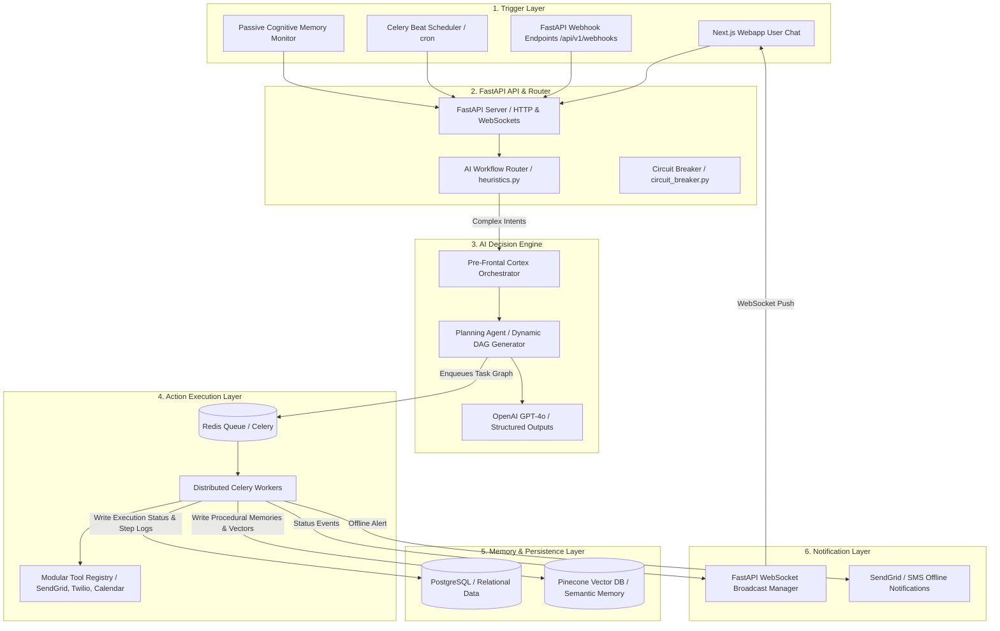

# Cognitive OS — Production Workflow Execution Architecture

This document specifies the production-level, event-driven, AI-powered workflow execution architecture for **Cognitive OS**. The system orchestrates modular actions, dynamic routing, asynchronous job execution, real-time feedback, and failure recovery.

---

## 1. System Topology & Architectural Overview

Cognitive OS employs a modular, event-driven microservices architecture. It decouples incoming user and webhook events from heavy LLM processing and long-running execution jobs using a high-throughput message broker and distributed task workers.



---

## 2. Detailed Architectural Layers

### 1. User Trigger Layer
The entry point for all system-initiated or user-initiated workflows.
*   **Manual triggers (User Chat):** Real-time interactive queries sent from the Next.js frontend via WebSockets or POST requests (`/api/v1/engine/process-query`).
*   **Webhook triggers:** External platforms (e.g., GitHub, Gmail, Slack) trigger webhook endpoints (`/api/v1/webhooks/*`). The payloads are immediately normalized and placed on the internal event bus.
*   **Temporal triggers (Scheduler):** Celery Beat runs continuously, periodically scanning the PostgreSQL `scheduled_tasks` table. It evaluates scheduled cron expressions and places tasks into the execution queue.
*   **AI Condition triggers:** Background workers analyze recent memory streams, task logs, and user notifications. When pre-defined threshold rules are matched (e.g., repeated project errors, high priority calendar events), they fire triggers autonomously.

### 2. AI Decision Engine
Acting as the **Pre-Frontal Cortex** of Cognitive OS, this component determines the task structure.
*   **Intent Parse & Reasoning:** The engine ingests user prompts alongside user preferences and relevant vector memory snippets.
*   **Dynamic DAG Generation:** If the workflow requires multi-agent interaction or tool chaining, the **Planning Agent** uses OpenAI Structured Outputs (`response_format={"type": "json_schema"}`) to decompose the query into a Directed Acyclic Graph (DAG) schema.
*   **Priority & Utility Scoring:** A priority engine scores tasks dynamically using the formula:
    $$\text{Score} = (\text{Impact} \times \text{Urgency}) \times \text{Confidence}$$
    *   *Impact (1–10):* LLM semantic rating of goal contribution.
    *   *Urgency (1–10):* Time-sensitivity score computed via LLM and clock context.
    *   *Confidence (0–1):* The cosine similarity score of the RAG context retrieved from Pinecone/ChromaDB.

### 3. Workflow Router
The **Traffic Controller** responsible for zero-latency routing.
*   **Hybrid Route Classifier:**
    1.  *Heuristic Rule-Engine (`heuristics.py`):* Regex and keyword-matching parser checks for quick shortcuts (e.g. "remind me to...", "draft mail to..."). Routing takes `< 5ms` with zero token costs.
    2.  *Semantic AI-Router (`core.py`):* For complex queries, a fast LLM agent (e.g., Llama-3.2-3B or GPT-4o-mini) maps the intent to a `WorkflowRoute` schema.
*   **Circuit Breaker Registry (`circuit_breaker.py`):** Wraps all agent modules. If an agent experiences repeated timeouts or connection failures (threshold = 3 failures), the circuit opens, rejecting subsequent calls or routing to fallback agents (e.g. `general_query` fallback).

### 4. Action Executor
The physical actions executor of the OS.
*   **Asynchronous Job Queue:** The orchestrator pushes generated DAG steps onto a **Redis Queue**. Async Celery/TaskIQ workers fetch and process nodes sequentially or in parallel depending on the DAG edges.
*   **Modular Action Registry:** A sandboxed framework hosting modules wrapper classes (e.g., SendGrid, Twilio, Google Calendar, Custom REST clients).
*   **State Machine:** Updates the execution state in the PostgreSQL `workflow_history` and `automation_logs` tables at each stage (`PENDING`, `RUNNING`, `SUCCESS`, `FAILED`).

### 5. Notification System
Bridges worker execution state back to the user client.
*   **WebSocket Broadcast:** When Celery workers complete a workflow step, they publish a state update event to Redis Pub/Sub. The FastAPI WebSocket server listens to these channels and pushes live JSON messages (`task.status.updated`) to the Next.js app.
*   **Offline Fallbacks:** If a client is disconnected and the workflow completes or fails, a notification dispatcher triggers email notifications via SendGrid or text updates via Twilio.

### 6. Memory Update Layer
The **Hippocampus** registers outcomes of execution for continuous learning.
*   **Procedural Memory Generation:** Upon successful automation completion, the inputs, DAG outputs, and logs are synthesized.
*   **Vectorization & Persistence:** The text is embedded via OpenAI's `text-embedding-3-small` and uploaded to **Pinecone** with metadata tags (e.g., `user_id`, `automation_id`, `timestamp`, `tags`).
*   **Episodic Linking:** In PostgreSQL, the run is linked to previous runs to construct sequential event chains.

### 7. Automation Logs Database
A relational database (PostgreSQL) tracking blueprints, schedules, states, and logs. It maps database transactions via Prisma/SQLAlchemy.

---

## 3. Database Schema Design (PostgreSQL)

```sql
-- 1. Core Users Table
CREATE TABLE users (
    id UUID PRIMARY KEY DEFAULT gen_random_uuid(),
    email VARCHAR(255) UNIQUE NOT NULL,
    full_name VARCHAR(255),
    firebase_uid VARCHAR(128) UNIQUE,
    preferences JSONB DEFAULT '{}',
    timezone VARCHAR(100) DEFAULT 'UTC',
    created_at TIMESTAMPTZ DEFAULT CURRENT_TIMESTAMP NOT NULL,
    updated_at TIMESTAMPTZ DEFAULT CURRENT_TIMESTAMP NOT NULL
);

-- 2. Automation Blueprints (Workflow Definitions)
CREATE TABLE automations (
    id UUID PRIMARY KEY DEFAULT gen_random_uuid(),
    user_id UUID NOT NULL REFERENCES users(id) ON DELETE CASCADE,
    name VARCHAR(255) NOT NULL,
    description TEXT,
    dag_definition JSONB NOT NULL, -- Defines Node actions and Edge dependencies
    is_active BOOLEAN DEFAULT TRUE NOT NULL,
    created_at TIMESTAMPTZ DEFAULT CURRENT_TIMESTAMP NOT NULL,
    updated_at TIMESTAMPTZ DEFAULT CURRENT_TIMESTAMP NOT NULL
);

-- 3. Workflow Execution History (Aggregated Runs)
CREATE TABLE workflow_history (
    id UUID PRIMARY KEY DEFAULT gen_random_uuid(),
    automation_id UUID NOT NULL REFERENCES automations(id) ON DELETE CASCADE,
    user_id UUID NOT NULL REFERENCES users(id) ON DELETE CASCADE,
    status VARCHAR(50) DEFAULT 'pending' NOT NULL, -- 'pending', 'running', 'completed', 'failed', 'partial'
    input_payload JSONB DEFAULT '{}' NOT NULL,
    output_result JSONB DEFAULT '{}' NOT NULL,
    started_at TIMESTAMPTZ DEFAULT CURRENT_TIMESTAMP NOT NULL,
    completed_at TIMESTAMPTZ,
    error_log TEXT
);

-- 4. Atomic Execution Logs (Step-by-step Task Logs)
CREATE TABLE automation_logs (
    id UUID PRIMARY KEY DEFAULT gen_random_uuid(),
    history_id UUID NOT NULL REFERENCES workflow_history(id) ON DELETE CASCADE,
    step_id VARCHAR(100) NOT NULL, -- matches step ID in the DAG
    agent_name VARCHAR(100) NOT NULL, -- e.g., 'summary-agent', 'execution-agent'
    status VARCHAR(50) NOT NULL, -- 'running', 'completed', 'failed'
    input_data JSONB,
    output_data JSONB,
    retry_count INT DEFAULT 0 NOT NULL,
    created_at TIMESTAMPTZ DEFAULT CURRENT_TIMESTAMP NOT NULL
);

-- 5. Temporal Trigger Schedules
CREATE TABLE scheduled_tasks (
    id UUID PRIMARY KEY DEFAULT gen_random_uuid(),
    user_id UUID NOT NULL REFERENCES users(id) ON DELETE CASCADE,
    automation_id UUID REFERENCES automations(id) ON DELETE SET NULL,
    trigger_type VARCHAR(50) NOT NULL, -- 'cron', 'webhook', 'ai_event'
    schedule_expression VARCHAR(100), -- e.g. "*/10 * * * *"
    last_run_at TIMESTAMPTZ,
    next_run_at TIMESTAMPTZ,
    is_enabled BOOLEAN DEFAULT TRUE NOT NULL,
    created_at TIMESTAMPTZ DEFAULT CURRENT_TIMESTAMP NOT NULL
);

-- Optimization Indexes
CREATE INDEX idx_automations_user_id ON automations(user_id);
CREATE INDEX idx_workflow_history_status ON workflow_history(status);
CREATE INDEX idx_automation_logs_history_id ON automation_logs(history_id);
CREATE INDEX idx_scheduled_tasks_next_run ON scheduled_tasks(next_run_at) WHERE is_enabled = TRUE;
```

---

## 4. API Endpoints & Core Data Flow

The sequential flow of requests through the layers is shown below:

```text
Next.js Client                 FastAPI Gateway              Redis Queue             Celery Worker           PostgreSQL & Pinecone
    |                               |                            |                        |                         |
    |--- POST /api/v1/execute ----->|                            |                        |                         |
    |    (payload: trigger/prompt)  |                            |                        |                         |
    |                               |--- Write history (pending) -------------------------------------------------->|
    |                               |                            |                        |                         |
    |                               |--- Generate Task DAG (AI) -|                        |                         |
    |                               |                            |                        |                         |
    |                               |--- Push job execution ---->|                        |                         |
    |                               |<-- Return Ack (Run UUID) --|                        |                         |
    |<-- HTTP 202 (Accepted) -------|                            |                        |                         |
    |                                                            |--- Pop task ---------->|                         |
    |                                                            |                        |--- Set run to 'running'|
    |                                                            |                        |---> Write to DB --------|
    |                                                            |                        |                         |
    |                                                            |                        |--- Run Step 1 (Tool)    |
    |                                                            |                        |--- Update step log ---->|
    |                                                            |                        |                         |
    |                                                            |                        |--- Run Step 2 (Tool)    |
    |                                                            |                        |--- Update step log ---->|
    |                                                            |                        |                         |
    |                                                            |<-- Publish status -----|                         |
    |                                                            |    event (completed)   |                         |
    |                               |<-- Event PubSub Listener --|                        |                         |
    |<-- WebSocket Status Push -----|                            |                        |                         |
    |    (UUID: Completed)          |                            |                        |--- Store vectors ------>|
    |                               |                            |                        |    (Pinecone)           |
```

### Core API Contracts

#### 1. Execute Workflow (Trigger Event)
*   **Route:** `POST /api/v1/workflows/trigger`
*   **Request Payload:**
```json
{
  "trigger_source": "user_chat",
  "payload": {
    "prompt": "Read the transcript for weekly sync, summarize it, and draft an email to alex@example.com"
  }
}
```
*   **Response Payload (HTTP 202 Accepted):**
```json
{
  "history_id": "8b52f44c-9f6e-49b4-b4a1-f3b145a1c322",
  "status": "pending",
  "message": "Workflow decomposition initialized."
}
```

#### 2. Read Execution Status
*   **Route:** `GET /api/v1/workflows/history/{history_id}`
*   **Response Payload:**
```json
{
  "history_id": "8b52f44c-9f6e-49b4-b4a1-f3b145a1c322",
  "status": "running",
  "started_at": "2026-05-26T11:51:00Z",
  "steps": [
    {
      "step_id": "step_1",
      "agent_name": "summary-agent",
      "status": "completed",
      "retry_count": 0,
      "output_data": {
        "summary": "Project Alpha launch scheduled for June 1st."
      }
    },
    {
      "step_id": "step_2",
      "agent_name": "execution-agent",
      "status": "running",
      "retry_count": 1,
      "output_data": null
    }
  ]
}
```

---

## 5. Failure Recovery & Resiliency Strategy

To achieve production-grade reliability, Cognitive OS leverages a four-tiered error handling protocol:

### Tier 1: Exponential Backoff with Jitter
Every atomic tool/API integration uses random jitter to prevent "thundering herd" issues:
```python
# Full-jitter backoff: sleep = random(0, min(cap, base * 2^attempt))
import secrets
delay = secrets.SystemRandom().uniform(0, min(max_delay_s, base_delay_s * (2 ** attempt)))
await asyncio.sleep(delay)
```
If an API (e.g., OpenAI or SendGrid) fails with a transient error (e.g., rate limit, 502 Bad Gateway), the execution worker retries up to 3 times before bubble-up.

### Tier 2: Agent-Level Circuit Breaking
Implemented globally via the `CircuitBreakerRegistry`:
*   When a worker attempts to route to an agent (e.g., `summary-agent`), it checks `circuit_registry.get("summary-agent").is_open()`.
*   If the circuit is **OPEN**, the router redirects the step to a fallback router (e.g., running the task using a local model or a fallback agent), or marks the step as failed without hitting the broken endpoint.
*   After a cooldown timeout (30 seconds), the circuit transitions to **HALF_OPEN** to test a probe request.

### Tier 3: State Reconstruction & Resume (Partial Completion)
If a step in a multi-node DAG fails permanently:
1.  The worker halts subsequent dependent nodes of the DAG.
2.  The workflow status in PostgreSQL is marked as `failed` (or `partial` if some independent paths succeeded).
3.  The intermediate states (inputs/outputs of successful steps) are stored safely inside `automation_logs`.
4.  Once the issue is resolved (e.g., API credentials updated, user updates input), the user can invoke `POST /api/v1/workflows/history/{history_id}/resume`. The orchestrator fetches the DAG, skips completed nodes, and resumes execution from the exact point of failure.

### Tier 4: Human-in-the-Loop Escalation
*   If an action requires high-security privileges (e.g., sending money, deleting repositories) or the agent confidence score drops below 0.65, execution halts and creates a `Reminder` or `EmailDraft` with a `pending_approval` state.
*   Next.js displays a premium interface prompting the user to approve or edit the data. The worker blocks execution until an approval event is received over WebSockets or API.
