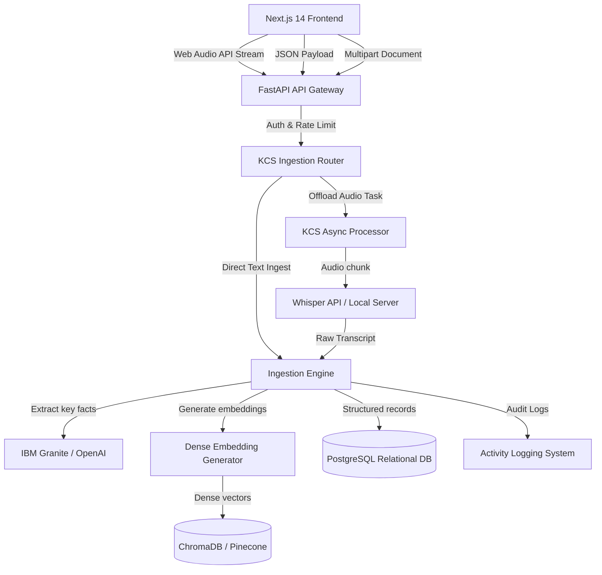
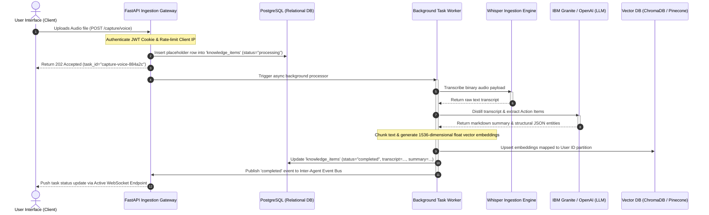

# Cognitive OS — Knowledge Capture System Architecture
## Premium Ingestion, Transcription, Multi-Pass Distillation, and Semantic Memory Storage

> [!NOTE]
> This architecture document outlines the technical specification for the Cognitive OS Knowledge Capture System. It details the end-to-end flow from low-latency client-side capture (audio/text/document uploads) to async deep-learning transcription (Whisper), structured multi-pass summarization (IBM Granite/OpenAI), relational indexing (PostgreSQL), and dense vector storage (ChromaDB/Pinecone).

---

## 1. Architecture Explanation & Core Flows

The **Knowledge Capture System (KCS)** is the primary sensory organ of Cognitive OS. It is designed around an asynchronous, decoupled pipeline to ensure that large file uploads and heavy deep learning operations (transcription, vector generation, LLM reasoning) never block the frontend user experience.



### 1.1. Frontend Ingestion Flow
The frontend is built inside the Next.js 14 App Router, utilizing native Web Audio APIs and a robust state machine for premium client-side feedback.
* **Audio Capture (Voice):** Captures microphone input using `MediaRecorder` in the browser, encoding directly into high-fidelity `audio/webm;codecs=opus` or standard `audio/wav` chunks. Chunks are buffered in memory and pushed in batches or streamed via raw chunk endpoints to reduce initial upload times.
* **Text & Note Uploads:** Structured markdown/plaintext areas use React Hook Form combined with Zod validation. File uploads (PDFs, DOCX, TXT) are read client-side to generate quick-look statistics (word count, size) before passing through a glassmorphic Drag-and-Drop file boundary.
* **Activity & Visual Feedback:** The dashboard renders visual waveforms, active upload progress bars, and high-fidelity micro-interactions (e.g., dynamic pulsating scanner lines) matching the brand's HSL warm-cream/charcoal editorial guidelines.

### 1.2. API Gateway & Routing
All ingestion routes are mounted under the `/api/v1/capture` router in FastAPI.
* Access is strictly bound to HTTPOnly JWT tokens validated via dependency injection.
* Endpoints utilize a rate-limiting middleware (sliding-window Redis pipeline) to protect processing queues from distributed file-upload exhaustion.

### 1.3. Backend Processing Flow
Once a payload is received, the API gateway immediately resolves metadata, logs the entry into PostgreSQL, and offloads heavy processing to an asynchronous task manager (FastAPI background tasks or Celery workers).
* **Whisper Transcription Engine:** Audio binaries are verified for mimetype integrity and dispatched to the Whisper API. Chunks longer than 25MB are dynamically split using `pydub` silent-interval detection to avoid API size constraints while maintaining linguistic boundaries.
* **Semantic Chunking:** The raw transcript or note text is split using a smart semantic splitter (recursive layout-aware parsing) rather than static token limits, ensuring lists, headings, and code blocks remain intact.

### 1.4. Memory Storage Pipeline (Dual-Database Core)
Memory is stored across two layers to facilitate exact relational query lookup and fuzzy semantic context injections:
1. **Relational Layer (PostgreSQL):** Stores exact transactional records, original audio metadata, transcription state, parent-child task associations, timestamps, and user associations inside a `knowledge_items` table.
2. **Vector Layer (ChromaDB / Pinecone):** Text chunks are vectorized using modern embedding models (e.g., `text-embedding-3-small` or local `nomic-embed-text`) and stored inside a multi-tenant semantic partition mapped by the user's tenant ID.

### 1.5. AI Summarization & Synthesis Flow
To turn raw transcripts into highly actionable episodic memory, the text undergoes a two-pass LLM synthesis pipeline powered by **IBM Granite** or **OpenAI**:
* **Pass 1 (Entity & Action Extraction):** Extracts key participants, absolute timelines, critical action items (assigned tasks), and structured key-value configurations.
* **Pass 2 (Contextual Distillation):** Synthesizes a high-level summary utilizing the OS editorial tone (Fraunces serif styling in the UI), formatting outputs into clean, markdown-friendly blocks.

### 1.6. Resilience & Error Handling
* **Transcription Fallbacks:** If the primary Whisper API suffers from timeout exceptions, KCS automatically shifts to a local lightweight processing wrapper (e.g., `faster-whisper` on GPU/CPU) or schedules the audio for queued retry with exponential jitter.
* **Circuit Breakers:** The LLM and VectorDB operations are wrapped in stateful circuit breakers. If Pinecone/ChromaDB is unreachable, the vector pipeline gracefully degrades to an in-memory NumPy fallback, allowing user saves to complete without losing raw transcripts.

### 1.7. Security & Compliance
* **Row-Level Security (RLS):** Both PostgreSQL and the Vector Database partition queries using the validated `user_id` context parameter, ensuring strict multi-tenant boundary isolation.
* **Encryption at Rest & Transit:** Audio files are stored in private cloud buckets using AES-256 server-side encryption. Transient audio files in backend containers are cleared immediately from memory/disk once the Whisper request resolves.

---

## 2. System Components Specifications

| Component Name | Primary Tech Stack | Responsibility | Key Interfaces / Methods |
| :--- | :--- | :--- | :--- |
| **`VoiceRecorder` Component** | Next.js 14, Web Audio API | Client-side mic recording, waveform visualization, dynamic chunk buffering. | `startRecording()`, `stopRecording()`, `streamChunk(blob)` |
| **`KCS Ingestion Gateway`** | FastAPI, Pydantic, Redis | Authenticates requests, rate limits public uploads, verifies file headers, and schedules background processing. | `/api/v1/capture/voice`<br>`/api/v1/capture/text`<br>`/api/v1/capture/file` |
| **`WhisperService`** | OpenAI Whisper API, `pydub` | Validates audio, runs silence-aware slicing, manages rate limits, and triggers transcription. | `transcribe_audio(file_bytes: bytes) -> str` |
| **`SemanticSplitter`** | LangChain / Custom recursive | Decomposes long text and transcripts into cohesive semantic nodes with 15% overlap. | `split_text(text: str) -> List[str]` |
| **`SynthesisEngine`** | IBM Granite, OpenAI GPT-4o | Extracts absolute entities, highlights action items, and generates highly compressed markdown summaries. | `summarize(text: str) -> SummarySchema` |
| **`MemoryVectorClient`** | ChromaDB / Pinecone, `numpy` | Generates dense embeddings, upserts vector payloads, and executes multi-tenant cosine-similarity lookups. | `upsert_vectors(chunks: List[dict])`<br>`semantic_search(query: str) -> List[dict]` |
| **`ActivityLogger`** | SQLAlchemy, PostgreSQL | Tracks capture transactions, logging capture events to the user's unified performance timeline. | `log_activity(user_id: UUID, action_type: str)` |

---

## 3. API Route Definitions

### 3.1. Voice Capture Endpoint
* **Route:** `POST /api/v1/capture/voice`
* **Format:** `multipart/form-data`
* **Payload:**
  ```multipart
  file: [Binary Audio Stream]
  metadata: { "session_id": "9b1deb4d-3b7d", "language": "en" }
  ```
* **Response (Async Scheduled):**
  ```json
  {
    "success": true,
    "task_id": "capture-voice-884a2c",
    "status": "processing",
    "message": "Audio payload uploaded. Transcription and summarization scheduled."
  }
  ```

### 3.2. Text Capture Endpoint
* **Route:** `POST /api/v1/capture/text`
* **Format:** `application/json`
* **Payload:**
  ```json
  {
    "content": "Meeting notes for Cognitive OS design sprint. Focus on typography constraints.",
    "source_metadata": { "origin": "browser_extension", "title": "Design Sprint Notes" }
  }
  ```
* **Response (Synchronous Ingestion):**
  ```json
  {
    "success": true,
    "item_id": "item-text-1122ab",
    "summary": "Design sprint notes emphasizing strict typography constraints.",
    "action_items_count": 3
  }
  ```

### 3.3. Document Upload Endpoint
* **Route:** `POST /api/v1/capture/file`
* **Format:** `multipart/form-data`
* **Payload:**
  ```multipart
  file: [PDF/TXT/DOCX Binary]
  options: { "run_deep_summary": true }
  ```
* **Response:**
  ```json
  {
    "success": true,
    "task_id": "capture-file-f99a3c",
    "status": "queued",
    "document_name": "quarterly_roadmap.pdf"
  }
  ```

---

## 4. End-to-End Data Ingestion Sequence Flow

The following describes the sequence of operations executing when a user uploads a voice capture:



---

## 5. Security & Verification Strategy

### Multi-Tenant Isolation
Every vector saved in the Vector DB (Chroma/Pinecone) is tagged with metadata constraints:
```json
{
  "tenant_id": "tenant_uuid_here",
  "user_id": "user_uuid_here",
  "source_origin": "voice_capture"
}
```
Queries enforce these parameters as hard filtering inputs to prevent any cross-tenant information disclosure.

### Verification Matrix
To ensure 100% reliability, the capture system is covered by three distinct integration test plans:
1. **Transcription Mock Integration:** Simulates audio binary transfer and returns a structured mock transcript, asserting that parsing functions execute cleanly.
2. **LLM Synthesis Grounding Guardrail:** Passes synthesized summaries through the `HallucinationGuardrail` to verify that all distilled facts exist in the raw transcription text before saving.
3. **Database Integrity & Cascades:** Validates that deleting a parent user cascadingly purges relational PostgreSQL data and corresponding semantic vectors in ChromaDB/Pinecone.
