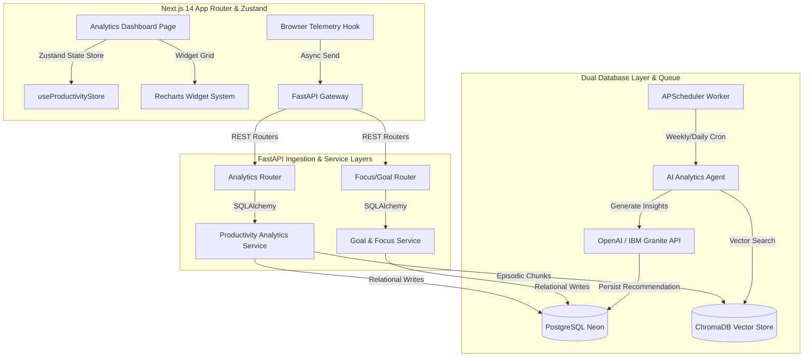
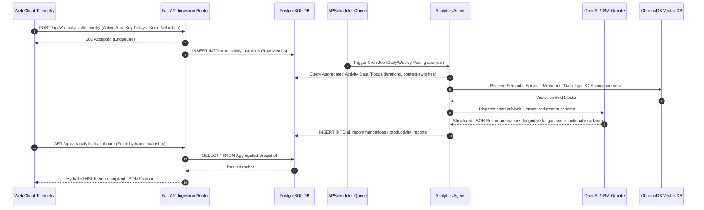

# Cognitive OS — Productivity Analytics Dashboard Architecture
## Architectural Blueprint, Data Models, API Endpoints, and AI Analytics Pipelines

> [!NOTE]
> This design document specifies the complete architecture for the **Productivity Analytics Dashboard** of **Cognitive OS**. It integrates with the active multi-agent event loop (`SupervisorAgent` → `MemoryAgent` → `SummaryAgent` → `ExecutionAgent`) and database layer, expanding them to track user cognitive load, focus windows, task velocity, and automated behavioral insights.

---

## 1. System Architecture & Component Mapping

The Productivity Analytics Dashboard decouples telemetry collection, background analysis, and visualization into a highly-performant, secure multi-tenant stack.



### A. Frontend Component Hierarchy
- `app/dashboard/analytics/page.tsx`: The main responsive editorial dashboard container.
- `components/analytics/MetricsGrid.tsx`: Stats banner displaying dynamic key performance indicators (Flow hours, cognitive load percentage, goal achievement velocity).
- `components/analytics/FocusTimeChart.tsx`: Recharts-based multi-layered area graph mapping focus durations against cognitive load levels.
- `components/analytics/CognitiveLoadWidget.tsx`: Dynamic radar/radial chart visualizing mental fatigue indicators (context-switching score, raw logging intensity, key delays).
- `components/analytics/GoalMilestones.tsx`: Interactive vertical progress timeline displaying active goals, agent-assisted micro-milestones, and deadline projections.
- `components/analytics/AIRecommendations.tsx`: Translucent glassmorphic card deck listing personalized, actionable, agent-driven work pacing adjustments with single-click automated delegation triggers.

### B. Zustand State Manager: `useProductivityStore`
A lightweight, fast, client-side store managing timeframe filters, widget layout customizations, active polling states, and data caching to prevent redundant backend REST roundtrips.

---

## 2. Ingestion & Data Flow Pipelines

Productivity analytics requires real-time telemetry processing alongside highly optimized background summarization loops to avoid locking Postgres transactions during intensive database operations.



---

## 3. PostgreSQL Database Schema

We define the physical data models mapping relational constraints, user IDs, and foreign keys. PostgreSQL handles strict metrics, while ChromaDB stores unstructured semantic context.

```python
import uuid
from datetime import datetime, timezone
from sqlalchemy import Column, String, Boolean, DateTime, ForeignKey, Text, Integer, Float, JSON
from sqlalchemy.dialects.postgresql import UUID, JSONB
from sqlalchemy.orm import relationship
from app.core.database import Base

def utcnow():
    return datetime.now(timezone.utc)

class ProductivityGoal(Base):
    """
    Goal Tracking Engine:
    Tracks high-level productivity targets, deadline compliance, and agent milestones.
    """
    __tablename__ = "productivity_goals"

    id = Column(UUID(as_uuid=True), primary_key=True, default=uuid.uuid4)
    user_id = Column(UUID(as_uuid=True), ForeignKey("users.id", ondelete="CASCADE"), index=True)
    title = Column(String(255), nullable=False)
    description = Column(Text, nullable=True)
    target_date = Column(DateTime(timezone=True), nullable=False)
    
    status = Column(String(50), default="active", index=True) # active, completed, delayed, abandoned
    completion_percentage = Column(Float, default=0.0, nullable=False)
    
    # Structured key results (e.g. {"milestones": [{"title": "Code PR", "completed": true}]})
    key_results = Column(JSONB, default=dict, nullable=False)
    
    created_at = Column(DateTime(timezone=True), default=utcnow)
    updated_at = Column(DateTime(timezone=True), default=utcnow, onupdate=utcnow)

    user = relationship("User", backref="productivity_goals")


class FocusSession(Base):
    """
    Focus Time Analysis:
    Tracks Pomodoro splits, distraction count, and context-switching heuristics.
    """
    __tablename__ = "focus_sessions"

    id = Column(UUID(as_uuid=True), primary_key=True, default=uuid.uuid4)
    user_id = Column(UUID(as_uuid=True), ForeignKey("users.id", ondelete="CASCADE"), index=True)
    goal_id = Column(UUID(as_uuid=True), ForeignKey("productivity_goals.id", ondelete="SET NULL"), nullable=True)
    
    started_at = Column(DateTime(timezone=True), default=utcnow, nullable=False)
    ended_at = Column(DateTime(timezone=True), nullable=True)
    
    duration_seconds = Column(Integer, default=0)
    interruption_count = Column(Integer, default=0)
    context_switch_count = Column(Integer, default=0) # Tab switches, active app changes
    flow_state_score = Column(Float, default=1.0) # 0.0 to 1.0 based on activity pacing
    
    created_at = Column(DateTime(timezone=True), default=utcnow)

    user = relationship("User", backref="focus_sessions")
    goal = relationship("ProductivityGoal", backref="focus_sessions")


class CognitiveLoadRecord(Base):
    """
    Cognitive Load Analysis:
    Combines input dynamics, semantic logs, and app switches to evaluate mental fatigue.
    """
    __tablename__ = "cognitive_load_records"

    id = Column(UUID(as_uuid=True), primary_key=True, default=uuid.uuid4)
    user_id = Column(UUID(as_uuid=True), ForeignKey("users.id", ondelete="CASCADE"), index=True)
    
    timestamp = Column(DateTime(timezone=True), default=utcnow, index=True)
    fatigue_index = Column(Float, nullable=False) # 0.0 (Perfect) to 1.0 (Burnout)
    
    # Input typing cadence, window shifts, cursor jitters
    keystroke_jitter = Column(Float, default=0.0)
    distraction_ratio = Column(Float, default=0.0) # non-productive app time vs productive
    
    raw_telemetry_summary = Column(JSONB, default=dict, nullable=False)
    
    created_at = Column(DateTime(timezone=True), default=utcnow)

    user = relationship("User", backref="cognitive_load_records")


class AIRecommendation(Base):
    """
    AI Productivity Recommendations:
    Actionable insights generated by IBM Granite / OpenAI based on historical records.
    """
    __tablename__ = "ai_recommendations"

    id = Column(UUID(as_uuid=True), primary_key=True, default=uuid.uuid4)
    user_id = Column(UUID(as_uuid=True), ForeignKey("users.id", ondelete="CASCADE"), index=True)
    
    title = Column(String(255), nullable=False)
    category = Column(String(100), nullable=False) # focus, pacing, delegation, goal_restructure
    description = Column(Text, nullable=False)
    
    priority_score = Column(Float, default=0.5) # Impact vs Urgency weighting
    is_actionable = Column(Boolean, default=True)
    action_payload = Column(JSONB, default=dict, nullable=True) # Direct parameters to launch agent workflows
    
    status = Column(String(50), default="pending", index=True) # pending, dismissed, executed
    
    created_at = Column(DateTime(timezone=True), default=utcnow)

    user = relationship("User", backref="ai_recommendations")


class ProductivityReport(Base):
    """
    Daily / Weekly Reports:
    Aggregated performance files synthesized and formatted as Markdown / PDF snapshots.
    """
    __tablename__ = "productivity_reports"

    id = Column(UUID(as_uuid=True), primary_key=True, default=uuid.uuid4)
    user_id = Column(UUID(as_uuid=True), ForeignKey("users.id", ondelete="CASCADE"), index=True)
    
    report_type = Column(String(50), nullable=False) # daily, weekly
    start_date = Column(DateTime(timezone=True), nullable=False)
    end_date = Column(DateTime(timezone=True), nullable=False)
    
    markdown_content = Column(Text, nullable=False)
    metrics_summary = Column(JSONB, nullable=False) # Serialized static statistics
    
    created_at = Column(DateTime(timezone=True), default=utcnow)

    user = relationship("User", backref="productivity_reports")
```

---

## 4. API Endpoint Specifications

FastAPI exposes REST interfaces for real-time telemetry inputs and aggregated metric outputs.

### A. Ingestion: `POST /api/v1/analytics/telemetry`
- **Purpose**: Record user telemetry (app events, scroll pacing, keystroke intervals).
- **Authentication**: Required (`JWT Access Token`).
- **Request Body (JSON)**:
```json
{
  "timestamp": "2026-05-28T12:00:00Z",
  "active_application": "VS Code",
  "window_title": "supervisor.py - backend",
  "app_switch_count": 2,
  "keystroke_count": 482,
  "keystroke_average_gap_ms": 182.5,
  "mouse_scroll_pixels": 1240,
  "is_distracting": false
}
```
- **Response**: `202 Accepted`

### B. Read Snapshot: `GET /api/v1/analytics/dashboard`
- **Purpose**: Retrieve fully hydrated stats, metrics, charts, and recommendations.
- **Query Params**: `days` (Default `7`)
- **Response (JSON)**:
```json
{
  "overview": {
    "total_focus_hours": 32.4,
    "average_flow_score": 0.88,
    "cognitive_load_average": 0.38,
    "goals_completed": 4
  },
  "focus_trend": [
    { "date": "2026-05-22", "focus_minutes": 240, "cognitive_load": 0.32 },
    { "date": "2026-05-23", "focus_minutes": 310, "cognitive_load": 0.45 }
  ],
  "cognitive_fatigue": {
    "fatigue_index": 0.41,
    "context_switches_per_hour": 12.8,
    "distraction_ratio": 0.15,
    "high_stress_pockets": ["14:00 - 16:00"]
  },
  "goals": [
    {
      "id": "e44c207d-5a82-4fcf-8472-358eb4bbfb1d",
      "title": "Complete Multi-Agent Integration",
      "completion_percentage": 85.0,
      "status": "active",
      "projected_completion": "2026-05-29T18:00:00Z"
    }
  ],
  "recommendations": [
    {
      "id": "bfa8022a-cfd0-4228-a53b-e018d9cc57df",
      "title": "Automate Docker Deployments",
      "category": "delegation",
      "description": "Your telemetry indicates 45 minutes spent manually configuring shell deployments. Let the execution agent write your deployment actions.",
      "priority_score": 0.92,
      "is_actionable": true,
      "action_payload": { "workflow": "generate_deployment_script" }
    }
  ]
}
```

### C. Execute Recommendation: `POST /api/v1/analytics/recommendations/{id}/execute`
- **Purpose**: Triggers active multi-agent automation loops to execute the recommended optimization task.
- **Response**: `202 Accepted`

---

## 5. Premium Visualization Dashboard Widgets

To stay strictly aligned with the **Cognitive OS Master Design System**, our dashboard widgets completely avoid stock Tailwind/shadcn components. They utilize hardware-accelerated backdrops, curated typographic contrast, and HSL custom-property variables.

### Visual Tokens (Dark Theme Configuration)
```css
:root {
  --brand-primary: #E8D5B7;     /* Warm amber-cream */
  --brand-ink: #1C1917;         /* Warm near-black */
  --brand-surface: #1E1B18;     /* Warm dark surface */
  --brand-card: #252219;        /* Warm amber-tinted cards */
  --brand-border: rgba(255, 255, 255, 0.07);
  --accent-ember: #C2410C;      /* Terracotta highlight */
  --accent-sage: #4D7C5F;       /* Grounded sage green */
  --accent-gold: #B45309;       /* Deep intelligence amber */
  
  --font-display: "Fraunces", "Playfair Display", serif;
  --font-body: "Outfit", "Switzer", sans-serif;
}
```

### Dashboard Widget Mockup Frame (Aesthetic Preview)

````carousel
```tsx
// Premium Focus Time Area Chart with Recharts
import React from 'react';
import { AreaChart, Area, XAxis, YAxis, Tooltip, ResponsiveContainer } from 'recharts';

export function FocusTimeChart({ data }) {
  return (
    <div className="backdrop-blur-2xl bg-[#1E1B18]/70 border border-white/[0.07] rounded-[24px] p-6 shadow-2xl relative overflow-hidden">
      <div className="flex justify-between items-center mb-6">
        <div>
          <span className="text-[10px] font-bold tracking-widest text-[#5C5448] uppercase">Focus Engine</span>
          <h3 className="text-xl font-bold text-white mt-1" style={{ fontFamily: 'Fraunces' }}>Flow Pacing Analysis</h3>
        </div>
        <div className="flex items-center gap-4 text-xs font-mono">
          <span className="flex items-center gap-1.5"><span className="w-2 h-2 rounded-full bg-[#E8D5B7]" /> Focus Time</span>
          <span className="flex items-center gap-1.5"><span className="w-2 h-2 rounded-full bg-[#C2410C]" /> Fatigue Index</span>
        </div>
      </div>
      
      <div className="h-64 w-full">
        <ResponsiveContainer width="100%" height="100%">
          <AreaChart data={data} margin={{ top: 10, right: 0, left: -20, bottom: 0 }}>
            <defs>
              <linearGradient id="focusColor" x1="0" y1="0" x2="0" y2="1">
                <stop offset="5%" stopColor="#E8D5B7" stopOpacity={0.2}/>
                <stop offset="95%" stopColor="#E8D5B7" stopOpacity={0}/>
              </linearGradient>
              <linearGradient id="fatigueColor" x1="0" y1="0" x2="0" y2="1">
                <stop offset="5%" stopColor="#C2410C" stopOpacity={0.2}/>
                <stop offset="95%" stopColor="#C2410C" stopOpacity={0}/>
              </linearGradient>
            </defs>
            <XAxis dataKey="date" stroke="#5C5448" fontSize={10} tickLine={false} />
            <YAxis stroke="#5C5448" fontSize={10} tickLine={false} />
            <Tooltip contentStyle={{ backgroundColor: '#252219', border: '1px solid rgba(255,255,255,0.07)', borderRadius: '12px' }} />
            <Area type="monotone" dataKey="focus_minutes" stroke="#E8D5B7" strokeWidth={1.5} fillOpacity={1} fill="url(#focusColor)" />
            <Area type="monotone" dataKey="cognitive_load" stroke="#C2410C" strokeWidth={1.5} fillOpacity={1} fill="url(#fatigueColor)" />
          </AreaChart>
        </ResponsiveContainer>
      </div>
    </div>
  );
}
```
<!-- slide -->
```tsx
// Actionable AI Recommendations Card Layout
import React from 'react';
import { Sparkles, ArrowRight, CheckCircle2 } from 'lucide-react';

export function AIRecommendationCard({ recommendation, onExecute }) {
  const isHigh = recommendation.priority_score > 0.8;
  return (
    <div className="backdrop-blur-2xl bg-[#252219]/60 border border-white/[0.07] rounded-[20px] p-5 hover:border-[#E8D5B7]/30 transition-all group duration-300">
      <div className="flex justify-between items-start gap-4">
        <span className={`px-2 py-0.5 rounded text-[8px] font-bold uppercase tracking-wider ${
          isHigh ? 'bg-[#C2410C]/10 text-[#C2410C]' : 'bg-[#B45309]/10 text-[#B45309]'
        }`}>
          {recommendation.category}
        </span>
        <span className="text-[10px] font-mono text-[#5C5448]">Priority {Math.round(recommendation.priority_score * 100)}%</span>
      </div>
      <h4 className="text-base font-bold text-white mt-3 group-hover:text-[#E8D5B7] transition-colors">{recommendation.title}</h4>
      <p className="text-xs text-[#A09880] mt-2 leading-relaxed leading-normal">{recommendation.description}</p>
      
      {recommendation.is_actionable && (
        <button 
          onClick={() => onExecute(recommendation.id)}
          className="mt-4 w-full h-10 bg-[#E8D5B7] hover:bg-[#FAF8F5] text-[#1C1917] font-bold rounded-xl text-xs flex items-center justify-center gap-1.5 transition-all shadow-md"
        >
          <Sparkles className="w-3.5 h-3.5" />
          Delegate to Execution Agent
          <ArrowRight className="w-3.5 h-3.5 stroke-[2] ml-1 group-hover:translate-x-1 transition-transform" />
        </button>
      )}
    </div>
  );
}
```
````

---

## 6. AI Analytics & Recommendation Pipeline

The AI Analytics Pipeline leverages the specialized **Analytics Agent** prompts combined with LLM text generation to distill massive streams of telemetry logs into brief, actionable focus tips and scheduling changes.

### A. Context Assembly
At the end of every analysis window (Daily at 23:59 UTC, Weekly on Sundays), the `APScheduler` runs the analytics job.
1. **Relational Aggregation**: Selects activity summaries, interruptions, focus hours, and raw telemetry averages from PostgreSQL.
2. **Episodic RAG Recall**: Queries ChromaDB vector indexes using semantic queries like `"cognitive overload fatigue stress points"` to retrieve unstructured notes, user feedback logs, and sensory transcripts.
3. **Optimized XML Construction**: Passes the resulting context arrays through the `TokenOptimizer` component to construct structured XML feeds.

### B. Prompt Ingestion Framework
The specialized system prompt ([analytics.py](file:///d:/cognitive-oos/backend/app/engine/prompts/agents/analytics.py)) instructs the LLM to output a strictly formatted JSON array containing structured optimization recommendations.

---

## 7. Key Technical Risks & Mitigations

Building high-frequency behavioral dashboards introduces several technical bottlenecks:

### Risk 1: High-Frequency Telemetry Ingestion Bottlenecks
- **Threat**: Sending mouse movements and keystroke cadences creates large network overhead and heavy Postgres write-locks.
- **Mitigation**: Batch telemetry logs on the frontend, using a client-side buffer. Transmit telemetry packets in consolidated chunks once every **60 seconds**, or via a unified WebSocket gateway, bypassing complex SQL writes by buffering inputs in a fast in-memory Redis cluster.

### Risk 2: LLM Token Exhaustion & Latency
- **Threat**: Running raw logging dumps directly into LLMs triggers token overflow and high operational costs.
- **Mitigation**: Pre-aggregate raw data on PostgreSQL using database statistical functions (such as averages and sums) so that the LLM is only fed heavily reduced metrics. Apply the workspace `TokenOptimizer` context filters to drop low-relevance logs.

### Risk 3: Vector DB Query Overhead
- **Threat**: Running heavy semantic similarity searches over episodic records for regular analytics snapshot endpoints degrades system performance.
- **Mitigation**: Decouple the REST query paths. The UI `/snapshot` route only reads pre-synthesized data from relational Postgres tables. The intensive RAG queries and vector searches only execute asynchronously during background cron executions.

### Risk 4: Multi-Tenant Data Isolation Leaks
- **Threat**: Data leakage between workspaces or tenants in aggregated analytical queries.
- **Mitigation**: Enforce strict user session validation in the FastAPI router dependencies. The database queries must utilize the verified `current_user.id` context on all relational queries and vector collection queries.

---
*Report compiled by the Product Design & Architecture Engineering Team.*
